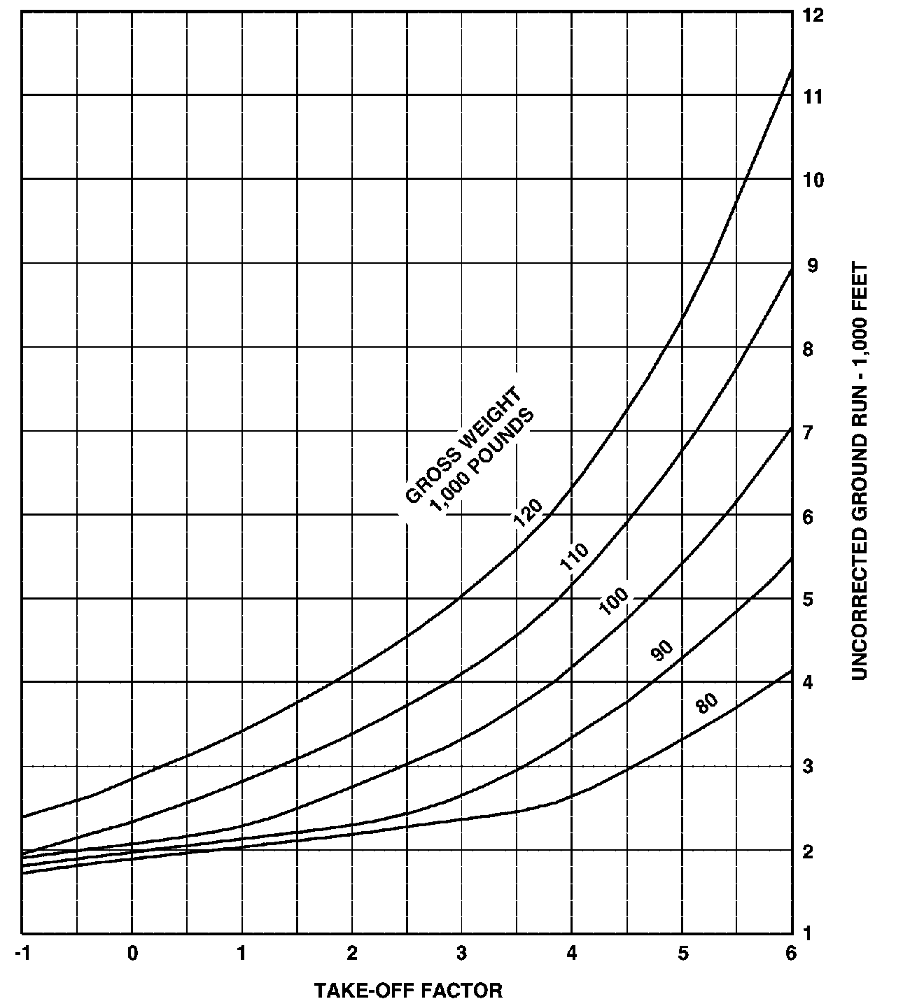
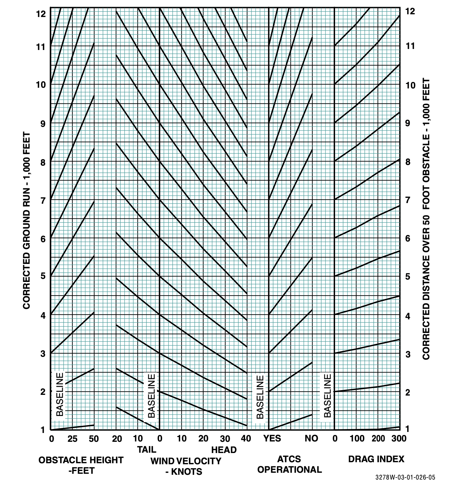

## Charts

This repository houses digitized charts for the DCS-C130J project.  Additionally, it defines the norms by which the Airplane Simulation Company shall process, store, and retrieve tabular data extracted from aircraft performance manuals.

If you are a good citizen, you will spend at least some time digitizing charts, so that I (someone_somewhere) do not lose my mind.  After all, if I lose my mind and am committed to an insane asylum, the prospects for future Airplane Simulation Company projects would be materially harmed.

#### Setup
Chart digitization requires several pieces of software.
Install these pieces of software in the exact order prescribed here.

1. Visual Studio Code
VScode is a free, lightweight code editor. We will use it to interact with github, as well as to interact with python notebooks.
https://code.visualstudio.com/download

2. Engauge Digitizer
While there are several software libraries designed to assist in data extraction from charts, this is the best I've found.
Installation:
windows: https://github.com/markummitchell/engauge-digitizer/releases/download/v12.1/digit-exe-windows10-64-bit-installer-12.1.msi
macos: https://github.com/markummitchell/engauge-digitizer/releases/download/v12.1/digit-exe-osx-12.1.pkg

3. Python 3.8 or higher
You may already have python installed on your computer. If you do not, install a recent release from either the windows store, homebrew (if using macos), or directly from the python software foundation website: https://www.python.org/downloads/
After installation, test that you can access the python interpreter by opening a powershell (windows) or bash terminal, and typing the word `python`, followed by pressing the enter key. (NOT the Windows command prompt is NOT powershell).
If you have successfully installed python, you will see a terminal window appear stating the version of python that you are running, followed by the date and system time, as well as a few other pieces of information.  Eg:
   ```
   Python 3.8.7 (default, Jan 20 2021, 13:42:04)
   [Clang 12.0.0 (clang-1200.0.32.28)] on darwin
   Type "help", "copyright", "credits" or "license" for more information.
   >>>
   ```
   If you see this window, you have successfully installed python, and may close the window.

4. Python dependencies
   This repo assumes that the python `pandas` library, as well as `jupyter` are installed locally.  Once you have installed python successfully, you may install these libraries as follows:
   1) Open a powershell (windows) or bash (linux/unix) terminal
   2) Copy the following directly into the terminal window, then press enter.
   ```
   python -m pip install --user pandas jupyter
   ```
   Some things will happen on the screen. When they stop, you will have installed pandas and jupyter.

5. VSCode Extensions
   To simplify the process of working with python notebooks in visual studio code, we will install the `Python` Vscode extension.
   To do so, simply open vscode, then, select the "Extensions" icon from the left side vertical navigation bar. Then type "Python" into the search. Install the extension named Python published by Microsoft.
   Do not install additional extensions.

6. Clone this repository in VSCode
   To do so, open VSCode and invoke the command menu by pressing left-alt+shift+p.  A small window will open on the top center of the screen.  In that box, type `Git Clone`.  Select the matching option, and past the following into the search bar: `https://github.com/dcs-hercules/digitized-charts`
   You may be prompted to log in using your github credentials.  You will know that you have succeeded if you have a folder named `digitized-charts` in your home directory (or wherever you put it, if you selected an option other than the default), with this document in the root.

   If you have completed the preceding steps, congratulations, you are now ready to digitize charts.

   If you have NOT been able to complete these steps, you are a poor candidate for chart digitization.  Do not attempt them a second time.

#### Converting a chart to something useful

The structure of this repository expects that the output of each chart be stored in its own diretory.
After selecting a chart for digitization, create a folder here with an appropriate name, long with two additional subfolders inside of it named `dig` and `raw_data`.
You will store the engauge-digitizer source documents in `dig/` and export their data to `raw_data`.

To process a chart in engauge digitizer, first crop the chart itself from the performance manual.  Be sure to leave the axes and their labels visible.

Next open engauge and select File -> Import to load your screenshot.
Now is a good time to save your chart! Make sure you select the correct location (probably, `C:\\Users\whoever-you-are\digitized-charts/whatever-folder-you-made/dig\`)

Engauge will now prompt you to click on the exact corners of the image. Start with the bottom left corner, then the bottom right, the the top left corners. We dont need to set all 4 corners, because of math.

You will now need to create a list of "curves".  For our purposes, a curve is a single line.
A chart may have only a few curves. This one has 5.


Charts may also have many curves.  This one has 44.


When digitizing multi-output charts like the one above, take note of the fact that the axes values will vary by the set of curves you are digitizing.

Because of this, we will need to save a different .dig project for each block of the chart.  Store these in the same directory with their siblings, as they all are required to compute a single output value.


